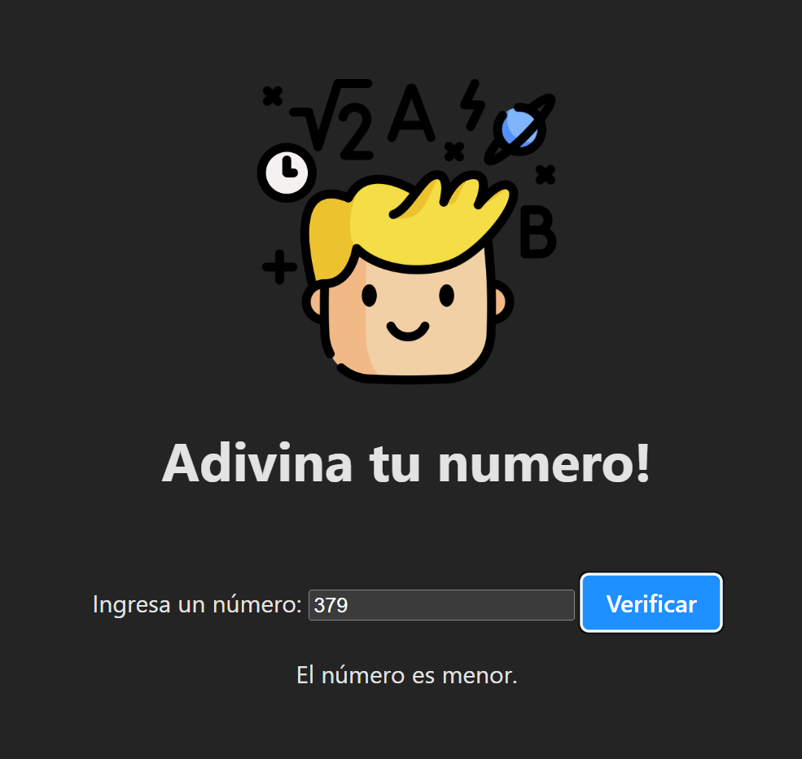

# Adivina el Numero




## Instalación

```bash
# Clonar el repositorio
git clone https://github.com/FarisR2/Guees-The-Number.git

# Navegar al directorio del proyecto
cd nombre-del-repositorio

# Instalar dependencias
npm install

# Ejecutar el proyecto 
npm run dev

```
## Ingresar al link con (crtl + click derecho) en windows

