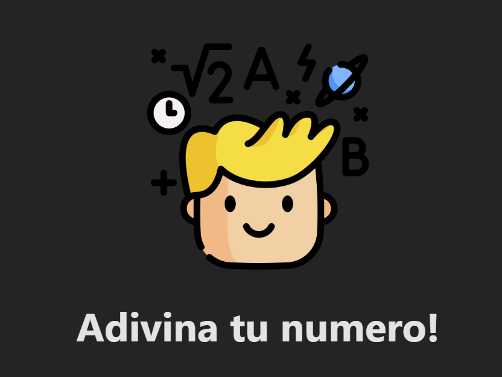
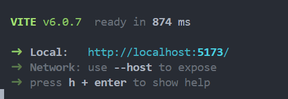

# Adivina el Numero




## Tabla de Contenidos

- [Instalación](#instalación)

## Instalación


```bash
# Clonar el repositorio
git clone https://github.com/FarisR2/Guees-The-Number.git

# Navegar al directorio del proyecto
cd nombre-del-repositorio

# Instalar dependencias
npm install

# Correr el proyecto en local
npm run dev

# Ingresar con crtl + click derecho en windows
